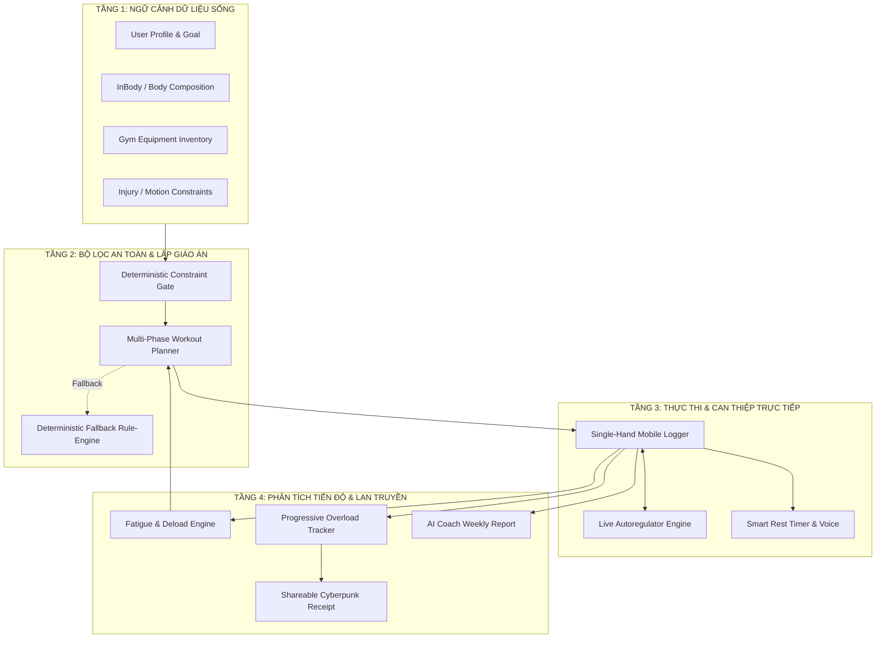

# GymAI Coach - Chiến lược Sản phẩm & Kiến trúc Kỹ thuật "Closed-Loop AI Coach"

**Tài liệu:** Product Strategy & Technical Architecture Spec  
**Mã tài liệu:** DOCS-STRATEGY-001  
**Ngày phê duyệt:** 2026-08-22  
**Trạng thái:** **APPROVED FOR IMPLEMENTATION (CEO Review Locked)**  
**Phạm vi:** Toàn bộ hệ thống GymAI Coach, bao gồm 3 tính năng đột phá: Live Autoregulation, Fatigue/Deload Engine và Shareable Cyberpunk Receipt.

---

## 1. Tầm nhìn & Định vị Chiến lược (Strategic Positioning)

### 1.1 Vấn đề cốt lõi của thị trường
Người tập thể hình hiện nay đang bị kẹt giữa 2 thái cực không hiệu quả:
1. **Ứng dụng ghi log truyền thống (Hevy, Strong, Jefit):** Rất tốt để ghi số nhưng **hoàn toàn thụ động**. Giáo án cố định, không biết phòng gym hôm nay có máy gì, không biết người dùng đang đau vai hay đuối sức, không tự động điều chỉnh buổi tập.
2. **AI Chatbot chung chung (ChatGPT, Claude, Gemini):** Có kiến thức nhưng **không có dữ liệu thời gian thực**. Không kết nối được với lịch sử tập, không hiểu thiết bị phòng gym, trả về giáo án dạng văn bản khó tương tác và dễ gây chấn thương do thiếu bộ lọc an toàn (Safety Guardrails).

### 1.2 Giải pháp độc bản: Closed-Loop Autonomous AI Coach
**GymAI Coach** là một hệ điều hành huấn luyện khép kín, hoạt động như một Huấn luyện viên Cá nhân (PT) đẳng cấp quốc tế luôn có mặt bên cạnh bạn:

> **"Biết bạn có gì hôm nay (thiết bị/thời gian) ➔ Biết cơ thể bạn chịu được gì (InBody/chấn thương) ➔ Lập giáo án chuẩn 3 pha ➔ Can thiệp tức thì trong buổi tập ➔ Tự động phân tích mệt mỏi & điều chỉnh chu kỳ."**

```text
┌─────────────────────────────────────────────────────────────────────────────┐
│                          VÒNG LẶP KHÉP KÍN (CLOSED LOOP)                     │
│                                                                             │
│  [1. NGỮ CẢNH ĐA NGUỒN]                                                     │
│   • Profile, InBody, Chấn thương                                            │
│   • Thiết bị phòng gym thực tế                                              │
│         │                                                                   │
│         ▼                                                                   │
│  [2. BỘ LỌC AN TOÀN DETERMINISTIC]                                          │
│   • Loại trừ tuyệt đối vùng đau                                             │
│   • Khóa candidate theo thiết bị sẵn có                                     │
│         │                                                                   │
│         ▼                                                                   │
│  [3. LẬP GIÁO ÁN 3 PHA] ──▶ [4. GHI CHÉP 1-TAY & CAN THIỆP THỜI GIAN THỰC]  │
│   • Khởi động (Warmup)         • Đổi bài tức thì khi máy bận                 │
│   • Bài chính (Main)           • Tự động hạ tạ / drop-set khi đuối sức      │
│   • Hạ nhiệt (Cooldown)                 │                                   │
│                                         ▼                                   │
│  [6. TỔNG KẾT & CHIA SẺ]   ◀── [5. ĐIỀU HÒA TIẾN ĐỘ & PHỤC HỒI]            │
│   • Thẻ Cyberpunk Story 9:16   • Tính điểm Fatigue mệt mỏi tích lũy         │
│   • Báo cáo HLV tuần           • Tự động lên lịch tuần Deload chống chững tạ│
└─────────────────────────────────────────────────────────────────────────────┘
```

---

## 2. Kiến trúc Hệ thống & Luồng Dữ liệu 4 Tầng



### Nguyên tắc Luồng Dữ liệu "Zero Silent Failures":
- **Happy Path:** LLM nhận ngữ cảnh đã sanitize ➔ Sinh JSON có cấu trúc ➔ Zod validate thành công ➔ Render UI.
- **Nil / Missing Input:** Thiếu InBody hoặc thiết bị ➔ Tự động kích hoạt profile cơ bản (Bodyweight/Dumbbell) an toàn, không báo lỗi đơ màn hình.
- **Error Path (API timeout / Rate limit):** Chuyển sang Deterministic Fallback Engine trong vòng 500ms ➔ Giáo án chuẩn khoa học vẫn xuất hiện kèm nhãn minh bạch.

---

## 3. Đặc tả 3 Tính năng Đột phá (Selective Expansions)

### 3.1 ⚡ Tính năng 1: Live In-Workout Autoregulation & Emergency Substitute

#### Bài toán thực tế:
Khi đang tập trong giờ cao điểm tại phòng gym:
- Người dùng phát hiện máy Leg Press bị người khác chiếm mất 15 phút.
- Hiệp thứ 2 bài Bench Press, người dùng cảm thấy khớp vai nhói đau hoặc đuối sức không nâng nổi tạ đã lên kế hoạch.

#### Giải pháp UX & Cơ chế xử lý:
1. **Nút [Máy đang bận] (1-Tap Machine Swap):**
   - **Input:** current_exercise_id, gym_id, workout_phase.
   - **Thuật toán:** Tìm bài tập thay thế thỏa mãn đồng thời:
     \text{Candidate} = \text{Same Primary Muscle} \cap \text{Available Equipment in Gym} \cap \text{Same Role (Compound/Accessory)}
   - **Tốc độ phản hồi:** $< 200\text{ms}$ (thực thi trên Local/Edge DB).
   - **UI:** Modal trượt từ dưới lên (Bottom Sheet) với 3 bài thay thế tốt nhất kèm nút "Áp dụng ngay".

2. **Nút [Quá đuối / Khớp khó chịu] (Live Load & Rep Autoregulator):**
   - **Tự động điều chỉnh Set tiếp theo:**
     - Nếu  = 0$ và thất bại trước số rep tối thiểu: Giảm \% - 15\%$ tạ cho các set còn lại.
     - Hoặc tự động chuyển set cuối cùng thành **Drop-set** hoặc **Myo-reps** để tối ưu hóa thể tích kích thích cơ bắp mà không làm quá tải khớp.

---

### 3.2 🛡️ Tính năng 2: Fatigue & Deload Engine (Quản lý Mệt mỏi & Tuần Xả Tạ)

#### Bài toán thực tế:
Người tập thường có xu hướng cố gắng nâng nặng liên tục qua nhiều tuần, dẫn đến quá tải hệ thần kinh trung ương (CNS Fatigue), đau nhức mãn tính và chững tạ.

#### Công thức Đánh giá Mệt mỏi (Fatigue Index):
Hệ thống tính toán chỉ số mệt mỏi buổi tập ({session}$) dựa trên Volume và RPE thực tế:
F_{session} = \sum_{i=1}^{N} \left( \text{Weight}_i \times \text{Reps}_i \times \frac{\text{RPE}_i}{10} \right) \times \text{MuscleFactor}

Chỉ số tích lũy 14 ngày ({cumulative}$):
- Nếu $\text{RPE Trung bình} \ge 9.2$ trong 2 tuần liên tiếp VÀ Tổng Volume giảm $> 5\%$ (Dấu hiệu quá tải).
- Hoặc người dùng đánh giá feedback energy <= 2/5 hoặc joint_pain == true trong 2 buổi liên tiếp.

#### Cơ chế Tự động Đề xuất Deload:
- AI Coach hiển thị thông báo:
  > *"⚠️ Phát hiện mệt mỏi tích lũy cao trong 14 ngày qua. Để bảo vệ khớp và chuẩn bị cho chu kỳ bứt phá mới, GymAI Coach đề xuất Tuần Deload."*
- **Kế hoạch Deload:**
  - Giảm \%$ số set (Volume giảm \%$).
  - Giảm mức tạ \% - 20\%$.
  - Tập trung hoàn hảo vào kỹ thuật (Mind-muscle connection & Tempo).

---

### 3.3 📱 Tính năng 3: Shareable Cyberpunk Workout Receipt

#### Bài toán thực tế:
Người tập gym luôn muốn chia sẻ thành tích sau buổi tập lên mạng xã hội (Instagram, Facebook Story, TikTok, Zalo). Các ảnh chụp màn hình thông thường trông thô kệch và không tạo động lực.

#### Thiết kế & Thông số Thẻ Tổng kết:
- **Tỉ lệ chuẩn:** $ (1080x1920px), tải nhanh dưới dạng SVG/Canvas hoặc PNG chất lượng cao.
- **Phong cách thị giác (Aesthetic):** Cyberpunk / Industrial Sci-Fi:
  - Nền đen xám carbon matte, viền cam neon glow (#FF6B00), ốc vít cơ khí 4 góc.
  - Typo mono sắc nét, vạch chia chỉ số dạng HUD máy bay tiêm kích.
- **Nội dung hiển thị:**
  1. **Header:** Tên buổi tập + Thời lượng + Badge cường độ (VD: CHEST & TRICEPS HYPERTROPHY // INTENSE).
  2. **Hero Metric:** Tổng tấn tạ nâng được (VD: TOTAL TONNAGE: 8,450 KG tương đương nâng 2 con voi).
  3. **PRs Highlight:** Các kỷ lục cá nhân mới phá vỡ trong buổi.
  4. **3D Muscle Glow:** Bản đồ cơ thể phát sáng các nhóm cơ vừa tập luyện cật lực.
  5. **Footer:** QR code dẫn về GymAI Coach profile / Watermark thương hiệu.

---

## 4. Đặc tả Database Schema & Migration

```sql
-- 1. Bảng lưu trữ can thiệp thời gian thực (In-workout autoregulations)
CREATE TABLE IF NOT EXISTS workout_autoregulations (
    id UUID PRIMARY KEY DEFAULT gen_random_uuid(),
    workout_id UUID NOT NULL REFERENCES workouts(id) ON DELETE CASCADE,
    user_id UUID NOT NULL REFERENCES auth.users(id) ON DELETE CASCADE,
    original_exercise_id UUID REFERENCES exercises(id),
    substituted_exercise_id UUID REFERENCES exercises(id),
    trigger_reason TEXT NOT NULL CHECK (trigger_reason IN ('equipment_busy', 'fatigue_overload', 'joint_pain', 'time_constraint')),
    adjustment_details JSONB NOT NULL DEFAULT '{}'::jsonb,
    created_at TIMESTAMPTZ NOT NULL DEFAULT now()
);

-- 2. Bảng theo dõi điểm mệt mỏi và phục hồi (Fatigue & Recovery Tracker)
CREATE TABLE IF NOT EXISTS user_fatigue_scores (
    id UUID PRIMARY KEY DEFAULT gen_random_uuid(),
    user_id UUID NOT NULL REFERENCES auth.users(id) ON DELETE CASCADE,
    calculated_date DATE NOT NULL DEFAULT CURRENT_DATE,
    cns_fatigue_index NUMERIC(5,2) NOT NULL,
    readiness_score NUMERIC(5,2) NOT NULL,
    deload_recommended BOOLEAN NOT NULL DEFAULT false,
    notes TEXT,
    created_at TIMESTAMPTZ NOT NULL DEFAULT now(),
    UNIQUE(user_id, calculated_date)
);

-- 3. RLS Security Policies
ALTER TABLE workout_autoregulations ENABLE ROW LEVEL SECURITY;
ALTER TABLE user_fatigue_scores ENABLE ROW LEVEL SECURITY;

CREATE POLICY "Users can only access their own autoregulation logs"
    ON workout_autoregulations FOR ALL
    USING (auth.uid() = user_id);

CREATE POLICY "Users can only access their own fatigue scores"
    ON user_fatigue_scores FOR ALL
    USING (auth.uid() = user_id);
```

---

## 5. Kế hoạch Triển khai (Execution Task Graph)

| Mã TIP | Tên Tính năng | Module phụ trách | Thời gian |
| :--- | :--- | :--- | :--- |
| **TIP-022** | **Live In-Workout Autoregulation** | src/app/(app)/workouts/[id]/ + src/lib/ai/substitute.ts | Giai đoạn 1 |
| **TIP-023** | **Fatigue & Deload Engine** | src/lib/training/fatigue.ts + src/app/api/ai/weekly/ | Giai đoạn 2 |
| **TIP-024** | **Cyberpunk Shareable Receipt** | src/components/shareable-workout-receipt.tsx | Giai đoạn 3 |

---

## 6. Tiêu chí Nghiệm thu (Acceptance Criteria)

1. ✅ **Emergency Swap:** Bấm nút "Máy đang bận" hiển thị ngay danh sách 3 bài thay thế hợp lệ trong phòng gym trong $< 300\text{ms}$.
2. ✅ **Autoregulation Guard:** Khi RIR = 0 ở hiệp 1-2, app tự động gợi ý giảm tải hiệp 3 để bảo vệ form.
3. ✅ **Fatigue Detection:** Tự động gắn tag [CẦN DELOAD] lên trang Progress khi chỉ số quá tải vượt ngưỡng an toàn.
4. ✅ **Export Story 9:16:** Người dùng có thể tải về hoặc copy ảnh Story tổng kết buổi tập với chất lượng đồ họa Cyberpunk hoàn hảo 1080x1920px.
