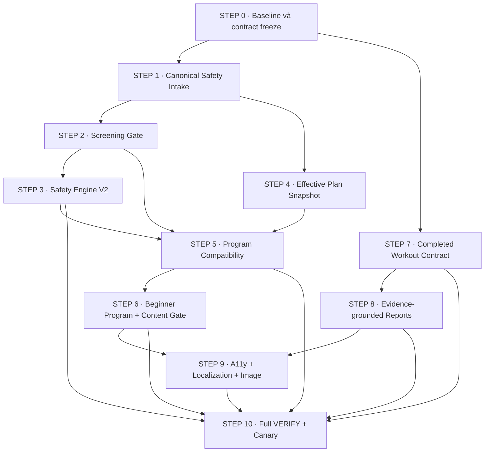

# MASTER PLAN - QA Remediation theo Contractor/Builder

**Trạng thái:** PLAN COMPLETE - chưa bắt đầu sửa code  
**Nguồn:** `.gstack/qa-reports/qa-report-localhost-2026-08-23.md`  
**Baseline:** 74/100 · PT safety FAIL · 2 Critical · 6 High · 3 Medium  
**Quyết định phát hành hiện tại:** HOLD luồng người mới tự phục vụ và AI Workout  
**Phạm vi kế hoạch:** đóng đủ ISSUE-001 đến ISSUE-011 bằng contract có version, test hồi quy và Contractor VERIFY độc lập.

---

## 1. Kết quả cuối cần đạt

Luồng người mới phải đi xuyên suốt theo một nguồn dữ liệu nhất quán:

1. Đăng ký và onboarding bằng tiếng Việt, dùng được với bàn phím và assistive technology.
2. Lưu lịch tập, thời lượng, thiết bị và lưu ý sức khoẻ vào contract có cấu trúc.
3. Sàng lọc an toàn cho kết quả xác định: `clear`, `modify` hoặc `medical_review`.
4. AI và giáo án chỉ dùng dữ liệu đã lưu; hard constraint không thể bị prompt, LLM hay fallback nới lỏng.
5. Chương trình không phù hợp không thể được kích hoạt im lặng.
6. Người mới 2 buổi × 30 phút có ít nhất một chương trình thật sự phù hợp.
7. Workout hoàn tất trở thành trạng thái terminal/read-only; mọi route đọc cùng số liệu thực tế.
8. Báo cáo chỉ nói những gì dữ liệu hỗ trợ và trả `insufficient_data` khi chưa đủ dữ liệu.
9. Black-box QA mới đạt tối thiểu 90/100, PT safety PASS, 0 Critical và 0 High.

Không coi plan này là phê duyệt apply migration, backfill dữ liệu, gọi Gemini, lưu workout thật, commit, push hoặc deploy. Mỗi mutation bên ngoài vẫn cần đúng cổng phê duyệt tại thời điểm thực hiện.

---

## 2. Phân tích nguyên nhân gốc

11 finding không phải 11 lỗi độc lập. Chúng quy về năm contract bị tách rời:

| Contract bị gãy | Dấu hiệu hiện tại | Issues |
|---|---|---|
| Safety intake | Onboarding ghi `profiles.injury_areas`; profile cá nhân hoá và AI đọc `training_constraints` | 001, 003 |
| Workout constraint | Movement limitation chủ yếu đi vào prompt; pre/post validator chưa kiểm tra taxonomy sức khoẻ và prompt cấm | 002 |
| Effective plan | Profile, active program, dashboard và generator tự suy ra days/duration/equipment khác nhau | 004, 005, 006 |
| Exercise/program content | Metadata suy từ tên, taxonomy thiếu, liều beginner và nội dung Front Squat không có gate tự động | 005, 007 |
| Completed workout/read model | Logger, done, dashboard, progress, feedback, PR và exercise stats tự tính riêng | 008, 011 |
| Interaction quality | Validation, accessibility state và copy báo cáo chưa có policy chung | 008, 009, 010 |

### Quyết định kiến trúc

Chọn hướng **canonical contracts + adapter có version + rollout theo gate**.

Không chọn vá từng màn hình vì lỗi sẽ tái xuất hiện ở consumer khác. Không chọn viết lại toàn hệ thống vì TIP-P01-P03, workout phases, equipment mapping và logger hiện có vẫn tái sử dụng được.

Ba nguyên tắc bắt buộc:

- Facts và safety rules được tính deterministic trước; LLM chỉ diễn giải hoặc chọn trong vùng đã cho phép.
- Base workout rows là nguồn sự thật; read model/caches chỉ là projection có thể đối chiếu và rebuild.
- Builder không tự tuyên bố READY. Contractor phải chạy lại test và authenticated E2E trước khi accept.

---

## 3. Sơ đồ giai đoạn và quan hệ phụ thuộc



### Cách chia lane

| Lane | Gói | Có thể chạy song song | Điểm giao cần khoá |
|---|---|---|---|
| A - Safety | QA01 → QA02 → QA03 | QA07 sau QA00 | `PersonalizationContextV2`, policy version |
| B - Program | QA04 → QA05 → QA06 | QA07 nếu không cùng sửa dashboard | `EffectiveTrainingPlanSnapshotV1` |
| C - Workout data | QA07 → QA08 | QA01-QA03 | `WorkoutActualsV1`, completion state |
| D - Interaction | QA09 | Chỉ sau UI chức năng ổn định | form state, focus, aria contract |
| Release | QA10 | Không | tất cả gate trước phải PASS |

Nếu hai Builder cùng làm, Contractor phải giao file ownership rõ. `dashboard/page.tsx`, `done/page.tsx`, `PersonalizationContext` và migration là vùng dễ xung đột, không giao đồng thời.

---

## 4. Quy trình giao thầu áp dụng cho mọi STEP

Mỗi STEP là một TIP độc lập theo trình tự sau:

1. **Contractor phát TIP:** đóng scope, AC, file boundary, mutation boundary và test bắt buộc.
2. **Builder characterization:** thêm test đỏ tái hiện finding trước khi sửa Critical/High.
3. **Builder implementation:** chỉ sửa file trong TIP; migration luôn additive.
4. **Builder Completion Report:** ghi `BUILDER COMPLETE - awaiting Contractor VERIFY`; không ghi READY.
5. **Contractor VERIFY:** kiểm diff, chạy lại command, authenticated browser scenario và DB/RLS khi có phép.
6. **Quyết định:** `READY`, `READY WITH DEFERRED` hoặc `NOT READY`.
7. **Acceptance của Homeowner:** bắt buộc trước mutation/deploy hoặc bước phụ thuộc có rủi ro cao.

Critical/High không được `READY WITH DEFERRED`. Static source assertion không thay cho authenticated E2E ở ISSUE-001, 002, 004, 006 và 011.

---

# GIAI ĐOẠN 0 - Khoá baseline và contract

## STEP 0 - TIP-QA00: Baseline, fixtures và release gates

**Issues:** hỗ trợ 001-011  
**Ưu tiên:** P0  
**Độ lớn:** M  
**Phụ thuộc:** không  
**Kết quả giai đoạn:** mọi finding có test/fixture và tiêu chí pass/fail định lượng trước khi Builder sửa hành vi.

### Phạm vi sửa

- Tạo fixture persona QA: beginner, knee concern, 2 ngày/tuần, 30 phút, gym standard.
- Lưu nguyên prompt cấm của ISSUE-002 làm fixture, không rút gọn.
- Tạo fixture workout hoàn tất cố định:
  - 3 bài;
  - 6 working sets;
  - 54 reps;
  - 1.360 kg;
  - planned 30 phút;
  - actual 360 giây;
  - feedback 2/3/3;
  - RIR actual là `null` nếu logger không thu.
- Viết characterization test đỏ cho 2 Critical và 6 High.
- Chuẩn hoá script test theo nhóm: unit, safety, completion, content, authenticated E2E, release.
- Chốt schema names và error codes dùng xuyên suốt plan.

### Không thuộc phạm vi

- Không sửa production behavior.
- Không apply migration, không tạo user/workout thật.
- Không thay baseline QA gốc.

### File/module dự kiến

- `tests/fixtures/qa-new-user.ts`
- `tests/qa-baseline.test.ts`
- `tests/qa-safety.test.ts`
- `tests/qa-completion.test.ts`
- `tests/qa-content.test.ts`
- `e2e/new-user-journey.spec.ts`
- `playwright.config.ts`
- `package.json`

### Step thực thi

1. Map từng ISSUE → AC → RT → evidence.
2. Viết fixture thuần, không phụ thuộc dữ liệu account QA đang tồn tại.
3. Thêm command tổng hợp nhưng giữ nguyên các script test hiện tại.
4. Chạy test characterization và ghi rõ test nào đỏ có chủ đích.
5. Contractor xác nhận baseline trước khi giao QA01/QA07.

### Acceptance criteria

- QA00-AC01: đủ 11 issue trong traceability matrix, không trùng hoặc bỏ sót.
- QA00-AC02: fixture workout tự đối chiếu ra đúng 6 sets, 54 reps, 1.360 kg và 360 giây.
- QA00-AC03: prompt ISSUE-002 được lưu nguyên văn và có assertions theo taxonomy, không chỉ dò tên bài.
- QA00-AC04: mỗi Critical/High có ít nhất một test đỏ trước fix.
- QA00-AC05: test account hiện có không bị sửa hoặc xoá.

### Bằng chứng nghiệm thu

- Test output red/green ledger.
- Diff chỉ gồm test/config/docs.
- `git diff --check` sạch trên path QA00.
- Contractor ký `BASELINE LOCKED`.

---

# GIAI ĐOẠN 1 - Chặn rủi ro an toàn

## STEP 1 - TIP-QA01: Canonical Safety Intake

**Issues:** ISSUE-001; nền cho 003 và 006  
**Ưu tiên:** P0 / release blocker  
**Độ lớn:** L  
**Phụ thuộc:** QA00; xác minh trạng thái TIP-P01 migration/RLS trước khi runtime E2E  
**Kết quả giai đoạn:** onboarding, profile, AI Coach, AI Workout và Programs đọc cùng constraint có revision.

### Contract cần khoá

- `training_constraints` là nguồn sự thật cho injury/movement limitation.
- `profiles.injury_areas` chỉ là legacy input cho backfill/adapter trong thời gian chuyển đổi, không là nguồn AI độc lập.
- `PersonalizationContextV2` phải chứa:
  - `contextVersion`;
  - `sourceRevision`;
  - declared schedule;
  - equipment scope/revision;
  - structured hard constraints;
  - screening disposition;
  - provenance tối thiểu, không chứa PII.
- Constraint chưa đủ side/severity/triggers mang `needs_confirmation`; không tự suy diễn thông tin lâm sàng.

### Phạm vi sửa

- Thay chuỗi client write rời rạc bằng server workflow/RPC atomic:
  1. update profile;
  2. upsert constraints;
  3. sync `profile_equipment`;
  4. chỉ set onboarding complete khi cả ba thành công.
- Backfill idempotent `profiles.injury_areas` → `training_constraints`.
- Tạo unique/upsert key ổn định theo user/region/source.
- Profile adaptive panel đọc đúng nguồn canonical.
- Tất cả AI surface đọc qua một context builder versioned.

### Không thuộc phạm vi

- Decision table sàng lọc y tế - QA02.
- Taxonomy joint demand và lọc bài - QA03.
- InBody consent/extraction.
- Thay nội dung chương trình.

### File/module dự kiến

- `src/app/onboarding/onboarding-form.tsx`
- `src/app/api/onboarding/complete/route.ts` hoặc server service tương đương
- `src/app/api/personalization/profile/route.ts`
- `src/app/(app)/profile/adaptive-profile-panel.tsx`
- `src/lib/ai/personalization-context.ts`
- `src/lib/ai/personalization-context.server.ts`
- migration additive mới; không sửa migration đã có thể được apply
- `src/types/database.ts`
- `tests/personalization-context.test.ts`
- `tests/onboarding-ui.test.ts`

### Step thực thi

1. Viết mapping legacy injury → canonical region code.
2. Chốt `PersonalizationContextV2` và adapter V1 → V2.
3. Viết transaction/upsert idempotent và error contract.
4. Chuyển onboarding sang một server boundary.
5. Chuyển profile và AI consumers sang canonical builder.
6. Tạo dry-run/backfill script và checksum.
7. Chạy unit/integration; sau phê duyệt migration mới chạy authenticated two-user RLS E2E.

### Acceptance criteria

- QA01-AC01: chọn `Đầu gối`, hoàn tất, reload → đúng một constraint `knee` xuất hiện ở Profile.
- QA01-AC02: planner, coach, weekly report và program resolver nhận cùng constraint/revision.
- QA01-AC03: submit onboarding hai lần không sinh duplicate.
- QA01-AC04: bất kỳ write con nào lỗi thì `onboarding_completed_at` không được set.
- QA01-AC05: User B không đọc/sửa constraint hoặc equipment User A.
- QA01-AC06: backfill dry-run có count; chạy lại không thêm row.
- QA01-AC07: context projection không chứa email, phone, full birthday, image path hoặc raw note không cần thiết.

### Rollback

- Giữ schema additive.
- Tắt writer V2 và đọc qua adapter V1 nếu cần; không drop row đã backfill.
- Không quay lại trạng thái onboarding “complete” khi constraint write thất bại.

---

## STEP 2 - TIP-QA02: Preparticipation Screening Gate

**Issues:** ISSUE-003  
**Ưu tiên:** P0 / release blocker  
**Độ lớn:** L  
**Phụ thuộc:** QA01  
**Kết quả giai đoạn:** self-service decision được tính deterministic, không do LLM quyết định.

### Contract cần khoá

```ts
type ScreeningDisposition = 'clear' | 'modify' | 'medical_review';
```

- `clear`: không có gate từ câu trả lời hiện tại; không có nghĩa “không có rủi ro”.
- `modify`: cho tiếp tục nhưng tạo hard constraints/giảm tải rõ.
- `medical_review`: chặn AI Workout và activation self-service server-side; hiển thị bước tiếp theo, không chẩn đoán.

### Phạm vi sửa

- Form ngắn có progressive disclosure cho:
  - triệu chứng cảnh báo;
  - tình trạng tim mạch/chuyển hoá/thận đã biết;
  - mức vận động hiện tại;
  - vùng và bên đau;
  - mức ảnh hưởng;
  - động tác gây khó chịu;
  - giới hạn vận động;
  - hướng dẫn/clearance chuyên môn nếu người dùng có.
- Pure decision table có policy version.
- Lưu screening revision dưới owner-only RLS, dữ liệu tối thiểu.
- Cho sửa/re-screen và giải thích vì sao trạng thái thay đổi.
- PT review copy và decision table trước Contractor accept.

### Không thuộc phạm vi

- Chẩn đoán, điều trị, bài phục hồi cá nhân.
- Lưu hồ sơ/tài liệu y tế.
- Thay thế dịch vụ cấp cứu hoặc bác sĩ.

### File/module dự kiến

- `src/app/onboarding/*`
- `src/app/(app)/profile/adaptive-profile-panel.tsx`
- `src/lib/safety/screening-policy.ts`
- `src/app/api/personalization/screening/route.ts`
- migration additive + RLS
- `tests/screening-policy.test.ts`
- E2E onboarding/keyboard

### Step thực thi

1. PT/Contractor duyệt question set và stop-copy.
2. Viết decision table bằng pure function và table-driven tests.
3. Thêm persistence/version/RLS.
4. Gắn gate vào generator và activation ở server boundary.
5. Thêm save/resume, focus và progressive disclosure.
6. Chạy decision matrix + mobile/keyboard + two-user RLS.

### Acceptance criteria

- QA02-AC01: mọi case trong decision table có output cố định.
- QA02-AC02: red flag → `medical_review`; gọi trực tiếp generator/activation cũng bị chặn.
- QA02-AC03: knee thiếu chi tiết → `needs_confirmation`, không bị hiểu thành clear.
- QA02-AC04: `modify` tạo constraint có region/side/triggers/status.
- QA02-AC05: refresh giữ trạng thái và giải thích bước tiếp theo.
- QA02-AC06: UI ghi rõ sàng lọc không phải chẩn đoán.

### Rollback

- Nếu policy/UI lỗi, fail-safe là chặn self-service và cho sửa sàng lọc/liên hệ chuyên môn.
- Không rollback bằng cách bỏ qua `medical_review`.

---

## STEP 3 - TIP-QA03: Deterministic Exercise Safety Engine V2

**Issues:** ISSUE-002; đồng bộ policy cho AI Coach/Workout  
**Ưu tiên:** P0 / release blocker  
**Độ lớn:** XL  
**Phụ thuộc:** QA01, QA02 và taxonomy tối thiểu  
**Kết quả giai đoạn:** không prompt, LLM, fallback hoặc draft tamper nào đưa bài vi phạm qua confirm.

### Contract cần khoá

```ts
type ResolvedWorkoutConstraintsV1 = {
  policyVersion: string;
  contextRevision: string;
  exerciseCount: number | null;
  durationMinutes: number;
  allowedEquipment: string[];
  deniedEquipment: string[];
  deniedExerciseSlugs: string[];
  deniedMovementPatterns: string[];
  deniedRegionsOrJoints: string[];
  deniedImpactLevels: string[];
  deniedPositions: string[];
};
```

Exercise metadata được kiểm duyệt phải có movement pattern, loaded region/joint, impact, position và required equipment. LLM không được tự gắn nhãn canonical.

### Phạm vi sửa

- Parser deterministic cho phủ định rõ bằng tiếng Việt/Anh, có dấu/không dấu.
- Nếu câu cấm mơ hồ không map được: `constraint_needs_confirmation`; không bỏ qua.
- Pre-LLM candidate filter bằng metadata canonical.
- Post-LLM validator đọc lại canonical exercise rows.
- Deterministic fallback đi qua cùng validator.
- Candidate pool không đủ → HTTP 422 `constraint_unsatisfied`.
- Dùng bảng tạm owner-only `workout_drafts` với TTL, status `draft/consumed/expired`, policy/context revision và structured constraint codes tối thiểu; không lưu raw health note/PII. Confirm luôn revalidate latest server context và mọi chỉnh sửa của client.
- Constraint trace từng bài: factor đã áp dụng, source, policy/context revision.
- Cùng safety policy được project sang AI Coach; lời khuyên không được mâu thuẫn với generator.

### Không thuộc phạm vi

- LLM chẩn đoán chấn thương.
- Tự nới hard constraint để đủ bài.
- Dùng tên bài làm taxonomy duy nhất.
- Persist workout khi mới generate draft.

### File/module dự kiến

- `src/lib/ai/workout-constraints.ts`
- `src/lib/ai/planner.ts`
- `src/lib/ai/workout-contract.ts`
- `src/lib/ai/schema.ts`
- `src/lib/ai/coach.ts`
- `src/app/api/workout/generate/route.ts`
- `src/app/api/workout/confirm/route.ts`
- `src/app/(app)/workouts/new/new-workout-form.tsx`
- exercise taxonomy migration/validator additive
- additive `workout_drafts` owner-only table, TTL/index/RLS và consumed-idempotency
- focused tests + authenticated E2E

### Step thực thi

1. Chốt taxonomy và policy reason codes.
2. Tạo `ResolvedWorkoutConstraintsV1` và parser tests.
3. Gắn pre-filter vào candidate query.
4. Gắn post-validator sau LLM và fallback.
5. Thêm server draft snapshot + confirm revalidation.
6. Hiển thị trace và trạng thái fail-closed dễ hiểu.
7. Chạy exact prompt QA, empty pool, tamper và property assertions.

### Acceptance criteria

- QA03-AC01: exact prompt QA trả đúng 3 bài thân trên bằng machine/cable nếu catalog đủ.
- QA03-AC02: output có 0 tag lower-body, squat, lunge, kneeling, jump, run, cycle, elliptical hoặc free-weight.
- QA03-AC03: pool không đủ trả 422 `constraint_unsatisfied`, không fallback vi phạm.
- QA03-AC04: draft bị thêm một exercise cấm trước confirm bị reject.
- QA03-AC05: context thay đổi sau generate buộc confirm revalidate, không dùng snapshot cũ âm thầm.
- QA03-AC06: mọi exercise có trace và policy version.
- QA03-AC07: movement limitation tác động vào filter, không chỉ nằm trong prompt.
- QA03-AC08: `constraint_violation_confirmed = 0` trong staging/canary.

### Rollback

- Có thể chạy shadow evaluation trước enforcement.
- Khi enforcement đã bật, fallback an toàn là tắt AI generation/chuyển sang manual reviewed library.
- Không quay lại generator unsafe cũ nếu Safety Engine V2 lỗi.

---

# GIAI ĐOẠN 2 - Một kế hoạch hiện hành và chương trình phù hợp

## STEP 4 - TIP-QA04: Effective Training Plan Snapshot

**Issues:** ISSUE-006  
**Ưu tiên:** P0 / release blocker  
**Độ lớn:** L  
**Phụ thuộc:** QA01  
**Kết quả giai đoạn:** profile, dashboard, program và generator hiển thị cùng declared/effective values và revision.

### Contract cần khoá

```ts
type EquipmentScope =
  | { kind: 'profile'; revision: string }
  | { kind: 'gym'; gymId: string; revision: string }
  | { kind: 'unrestricted'; confirmedAt: string };

type EffectiveTrainingPlanSnapshotV1 = {
  declared: { daysPerWeek: number; minutesPerSession: number };
  effective: { daysPerWeek: number; minutesPerSession: number };
  equipment: EquipmentScope;
  source: 'profile' | 'active_program' | 'explicit_override';
  revision: string;
  overrideReason: string | null;
};
```

`gymId = null` không còn đồng thời nghĩa là profile equipment và unrestricted.

### Phạm vi sửa

- Pure resolver cho declared/effective schedule.
- Generator mặc định dùng profile equipment; unrestricted chỉ khi người dùng chọn rõ.
- Dashboard bỏ fallback `programDays.length || 3`.
- Duration mặc định và AI context đọc cùng snapshot.
- UI hiển thị profile gốc, giá trị hiệu lực và lý do override.
- Optimistic concurrency bằng revision; request cũ không ghi đè setting mới.

### Không thuộc phạm vi

- Chấm compatibility - QA05.
- Nội dung program - QA06.
- Workout analytics - QA07.

### File/module dự kiến

- `src/lib/training/effective-plan.ts`
- `src/lib/equipment-presets.ts`
- `src/lib/ai/personalization-context*.ts`
- `src/app/(app)/dashboard/page.tsx`
- `src/app/(app)/workouts/new/page.tsx`
- `src/app/(app)/workouts/new/new-workout-form.tsx`
- profile/program loaders and tests

### Step thực thi

1. Chốt precedence declared → program → explicit override.
2. Viết pure resolver + concurrency tests.
3. Chuyển dashboard/context/generator sang resolver.
4. Tách ba equipment scope trong API và UI.
5. Chạy multi-route authenticated E2E với persona QA.

### Acceptance criteria

- QA04-AC01: persona QA thấy 2 buổi, 30 phút, profile/gym-standard equipment ở mọi route.
- QA04-AC02: generator không mặc định unrestricted.
- QA04-AC03: dashboard, profile, generator và context có cùng revision.
- QA04-AC04: unrestricted chỉ xuất hiện sau thao tác rõ của user.
- QA04-AC05: chưa active program vẫn giữ 2 buổi, không fallback 3.
- QA04-AC06: đổi setting tạo revision mới; stale write bị reject có typed error.

### Rollback

- Shadow compare old/new resolver trước khi bật UI.
- Rollback consumer flag về resolver cũ nhưng giữ revision/audit; không xoá dữ liệu mới.

---

## STEP 5 - TIP-QA05: Program Compatibility và Atomic Activation

**Issues:** ISSUE-004  
**Ưu tiên:** P0 / release blocker  
**Độ lớn:** L  
**Phụ thuộc:** QA02, QA03, QA04  
**Kết quả giai đoạn:** không program nào lệch experience/safety/schedule/equipment được activate im lặng hoặc bypass server.

### Contract cần khoá

```ts
type CompatibilityStatus =
  | 'recommended'
  | 'compatible'
  | 'requires_confirmation'
  | 'blocked';
```

Result chứa reason codes riêng cho experience, days, duration, safety, equipment và screening; UI ưu tiên lý do hơn một fit score khó giải thích.

### Phạm vi sửa

- `evaluateProgramCompatibility()` pure và versioned.
- Một activation service/endpoint duy nhất cho list và detail.
- Atomic mutation: validate → deactivate old → activate new; lỗi giữ program cũ.
- Lưu compatibility snapshot, policy version và override reason.
- Rank/label program theo fit.
- Mismatch mềm có confirmation; unresolved safety/medical review là block.

### Không thuộc phạm vi

- Sửa seed program - QA06.
- AI tự quyết định override.
- Xoá program hệ thống.

### File/module dự kiến

- `src/lib/programs/compatibility.ts`
- `src/lib/programs/data.ts`
- `src/lib/programs/types.ts`
- `src/app/api/programs/activate/route.ts` hoặc server service
- programs list/detail UI
- additive migration cho activation audit/reason nếu cần
- `tests/program-compatibility.test.ts`

### Step thực thi

1. Chốt factor/reason matrix.
2. Viết pure evaluator tests.
3. Hợp nhất hai activation path vào một boundary.
4. Thêm transaction/idempotency và override audit.
5. Hiển thị state/reasons/confirmation.
6. Test list, detail và direct API bypass.

### Acceptance criteria

- QA05-AC01: beginner 2×30 + knee không thể one-click activate PPL 6-day.
- QA05-AC02: direct API/server action bypass cũng bị gate.
- QA05-AC03: request bị reject không làm mất active program hiện tại.
- QA05-AC04: list/detail trả cùng compatibility result và policy version.
- QA05-AC05: override hợp lệ có xác nhận, lý do và audit; không sửa profile declared âm thầm.
- QA05-AC06: unresolved safety/medical_review luôn `blocked`.

### Rollback

- Có thể rollback ranking UI.
- Không rollback server safety block.
- Mutation failure phải giữ nguyên active program trước đó.

---

## STEP 6 - TIP-QA06: Beginner 2×30 Program và Content Quality Gate

**Issues:** ISSUE-005, ISSUE-007  
**Ưu tiên:** P1 nhưng là release blocker cho beginner self-service  
**Độ lớn:** XL  
**Phụ thuộc:** QA03, QA04, QA05  
**Kết quả giai đoạn:** có ít nhất một program phù hợp persona QA và catalog/program seed không còn lỗi taxonomy cơ bản.

### Phạm vi sửa - program beginner

- Seed additive ở trạng thái hidden/reviewed trước publish.
- Đúng 2 ngày không liền nhau.
- Mỗi buổi trong budget 30 phút theo estimator thống nhất.
- Warm-up tổng quát + đặc hiệu; cooldown đúng loại nội dung thực tế.
- 4-6 bài chính, tuần đầu 1-2 working sets/bài.
- Phần lớn 8-12 reps; RIR 3-4; progression bảo thủ.
- Không dùng deadlift 3-5, front squat hoặc weighted plank làm mặc định beginner.
- Knee-aware variation phải đi qua Safety Engine, không gắn nhãn “an toàn cho mọi chấn thương”.

### Phạm vi sửa - validator/catalog

- Validate unit reps/seconds, set totals, duration, rest source, difficulty eligibility, encoding, taxonomy completeness và equipment coverage.
- Set totals ở card/detail/muscle map dùng một calculator.
- Front Squat golden record:
  - primary muscle/taxonomy nhất quán;
  - phân biệt default rest và program-specific rest;
  - có brace, rack/safety pin, front-rack options, common mistakes và pain stop rule;
  - regressions/substitutions được safety engine kiểm tra;
  - user thường không thể publish video URL chưa kiểm duyệt.
- PT sign-off seed và golden content trước publish.

### Không thuộc phạm vi

- Sửa toàn bộ catalog bằng AI tự động.
- Tuyên bố điều trị đau đầu gối.
- Upload/publish hàng loạt media chưa review.

### File/module dự kiến

- migration program additive mới
- `src/lib/programs/*`
- `src/components/programs/program-days-viewer.tsx`
- `scripts/validate-exercises.ts`
- `scripts/validate-exercise-taxonomy.ts`
- content schema/editor/publish permissions
- exercise detail Front Squat fixture
- `tests/program-content.test.ts`
- `tests/exercise-content.test.ts`

### Step thực thi

1. Chốt program dose và estimator với PT.
2. Viết program fixture + validator tests trước seed.
3. Tạo additive seed hidden.
4. Chuẩn hoá calculator set/duration và UI consumers.
5. Sửa Front Squat golden record + publish permission.
6. Chạy validator toàn catalog/program; phân loại lỗi blocking/non-blocking.
7. PT review; chỉ chuyển program sang visible sau sign-off.

### Acceptance criteria

- QA06-AC01: đúng 2 ngày không liền nhau; mỗi buổi ≤30 phút.
- QA06-AC02: tuần đầu ≤2 working sets/bài, target RIR 3-4.
- QA06-AC03: không chứa exercise intermediate-only/advanced làm mặc định.
- QA06-AC04: hold/time hiển thị giây, không `30-60 reps`.
- QA06-AC05: card/detail/muscle totals trùng nhau.
- QA06-AC06: fixture knee được substitute hợp lệ hoặc block; không giữ bài xung đột.
- QA06-AC07: validator bắt encoding hỏng, taxonomy/rest/set mismatch.
- QA06-AC08: Front Squat đạt golden checklist và video publish permission test.
- QA06-AC09: PT ký content sign-off.

### Rollback

- Hide/deactivate program mới; không delete history của user đã dùng.
- Không sửa migration cũ đã apply; forward-fix bằng migration mới.

---

# GIAI ĐOẠN 3 - Một nguồn sự thật sau khi hoàn tất workout

## STEP 7 - TIP-QA07: Canonical Completion State và WorkoutActualsV1

**Issues:** ISSUE-011; cung cấp facts cho ISSUE-008  
**Ưu tiên:** P0 / release blocker  
**Độ lớn:** XL  
**Phụ thuộc:** QA00; có thể chạy song song Lane A sau khi file ownership được tách  
**Kết quả giai đoạn:** completed workout terminal/read-only; mọi consumer nhận cùng actuals.

### State machine cần khoá

```text
planned -> in_progress -> completed
   |            |
   +----------> skipped

completed = terminal
```

- Completion đi qua server transaction/RPC idempotent.
- `completed_at` bất biến sau lần hoàn tất đầu tiên.
- Insert/update/delete exercise/set của workout completed bị chặn ở DB/server, không chỉ ẩn nút UI.
- Sửa lịch sử sau này là TIP riêng có audit; không nằm trong bản sửa release này.

### Canonical read contract

```ts
type WorkoutActualsV1 = {
  workoutId: string;
  status: 'completed';
  plannedDurationMinutes: number | null;
  actualDurationSeconds: number | null;
  completedMainWorkingSets: number;
  totalReps: number;
  totalVolumeKg: number;
  exercises: Array<{
    exerciseId: string;
    setCount: number;
    repMin: number | null;
    repMax: number | null;
    avgActualRir: number | null;
    volumeKg: number;
  }>;
  feedback: { difficulty: number; energy: number; quality: number; note: string | null } | null;
};
```

Quy tắc:

- Actual duration không fallback sang planned duration.
- Volume chỉ tính completed main working reps sets; warm-up/time/hold không bị cộng vào kg volume.
- RIR thiếu giữ `null`, không đổi thành 0 hoặc target RIR.
- Rep range là min-max actual, không dựng `${average}-${average+2}`.
- Lần đầu tạo baseline, chưa tự gọi là PR. PR chỉ xuất hiện khi vượt prior eligible baseline theo rule công khai.
- Pause nếu được hỗ trợ phải được lưu server-side (`paused_at`/`paused_seconds` hoặc contract tương đương); refresh không được làm mất pause duration.
- Nếu dùng SQL fact views, tạo `workout_exercise_facts_v1` và `workout_facts_v1` với quyền thực thi giữ nguyên owner RLS (`security_invoker` hoặc boundary đã được chứng minh tương đương).

### Phạm vi sửa

- Completion endpoint/RPC atomic + idempotent.
- DB/server guard chống sửa completed descendants.
- Pure projector/read service `WorkoutActualsV1` từ base rows.
- Bỏ mọi mutation khỏi GET `/workouts/{id}`; default sets phải được tạo trong create/confirm workflow.
- Dashboard, history, done, progress, weekly facts và exercise performance dùng projector/aggregate từ cùng rule.
- Route `/workouts/{id}` của completed redirect/render read-only; timer dừng ở completed_at.
- Feedback form hydrate existing 2/3/3 và cho update rõ nếu policy cho phép.
- Denormalized `exercise_user_stats`/`personal_records` là cache; có rebuild/checksum, không là nguồn duy nhất.

### Không thuộc phạm vi

- UI sửa workout lịch sử.
- Thay planned program metrics.
- Ép workout đầu tiên phải sinh PR.

### File/module dự kiến

- `src/lib/workouts/actuals.ts`
- `src/app/api/workouts/[id]/complete/route.ts` hoặc RPC wrapper
- `src/app/(app)/workouts/[id]/page.tsx`
- `src/app/(app)/workouts/[id]/workout-logger.tsx`
- `src/app/(app)/workouts/[id]/done/page.tsx`
- `feedback-form.tsx`
- workouts/history/dashboard/progress pages
- `src/app/api/exercise-performance/route.ts`
- additive migration cho guards/function/index/checksum support
- focused unit, DB integration, authenticated multi-route E2E

### Step thực thi

1. Chốt state transition, immutability và baseline/PR rule.
2. Viết pure projector với fixture 3 bài/6 set.
3. Add migration/RPC/fact views nhưng chưa siết client cũ; giữ feature flag off.
4. Chuyển completion sang RPC và các consumers sang contract mới.
5. Hydrate feedback; tách planned/actual labels; bỏ mutation khỏi GET.
6. Sau khi app không còn write path cũ, mới bật DB guards cho completed descendants.
7. Thêm cache rebuild/checksum và shadow compare.
8. Chạy reload/reopen/direct-write tamper E2E.

### Acceptance criteria

- QA07-AC01: complete gọi hai lần cho cùng completed_at/result; không duplicate stats/PR.
- QA07-AC02: reopen completed workout không tăng timer và không có control sửa/add set.
- QA07-AC03: direct client/API write vào set/exercise completed bị reject.
- QA07-AC04: fixture hiển thị đúng 360 giây actual, 30 phút planned, 6 sets, 54 reps, 1.360 kg trên mọi route.
- QA07-AC05: feedback 2/3/3 tồn tại đúng sau reload.
- QA07-AC06: exercise reps hiển thị 8-9 nếu actual là 8 và 9; avg actual RIR là `null/Chưa có dữ liệu` nếu không thu.
- QA07-AC07: dashboard/history/progress/weekly/exercise projection checksum giống nhau.
- QA07-AC08: workout đầu tiên tạo baseline theo policy, không bắt buộc PR > 0.
- QA07-AC09: User B không complete/read/write workout User A.
- QA07-AC10: GET completed workout không insert default set hoặc tạo bất kỳ mutation nào.

### Rollback

- Schema/view/RPC additive được triển khai trước flag; completed guards chỉ bật sau khi app đã chuyển khỏi write path cũ.
- Nếu read model mới sai, giữ completed read-only, tắt consumer projection mới và fallback factual tối thiểu.
- Không rollback bằng cách mở lại completed workout cho sửa.

---

# GIAI ĐOẠN 4 - Báo cáo có bằng chứng và giảm ma sát

## STEP 8 - TIP-QA08: Evidence-grounded Weekly/Done Reports

**Issues:** ISSUE-008  
**Ưu tiên:** P1 / High release blocker  
**Độ lớn:** L  
**Phụ thuộc:** QA07  
**Kết quả giai đoạn:** báo cáo không còn bịa narrative, chấm điểm hoặc kê con số chính xác khi input không hỗ trợ.

### Contract cần khoá

```ts
type EvidenceKind = 'measured' | 'user_reported' | 'estimated';
type ReportDataStatus = 'insufficient_data' | 'factual' | 'trend_ready';
```

- Facts tính bằng code trước khi gọi LLM.
- 0 workout → `insufficient_data`, không gọi Gemini để kể chuyện hoặc kê bài.
- Query/database lỗi → `training_data_unavailable`; tuyệt đối không biến lỗi thành 0 workout.
- 1 workout → factual recap; chưa gọi là xu hướng.
- Done page bỏ A+/93 và claim “đạt chuẩn khoa học”. Việc tái thiết kế score là TIP riêng sau khi có công thức/inputs được duyệt.
- Không đưa dosage dinh dưỡng/hydration/recovery chính xác nếu thiếu dữ liệu và phạm vi chuyên môn.

### Phạm vi sửa

- `WeeklyFactsV1` lấy từ canonical actuals.
- Minimum-data policy và typed status.
- LLM output schema/validator: không được đổi facts, không unsupported physiological claim.
- Fallback factual deterministic.
- UI phân biệt measured, user-reported và estimated.
- Cùng context/policy với coach và generator; hard constraints không bị report gợi ý bài xung đột.

### Không thuộc phạm vi

- Tư vấn dinh dưỡng lâm sàng.
- Tái giới thiệu performance score.
- Dự đoán chẩn đoán/phục hồi cá nhân.

### File/module dự kiến

- `src/lib/ai/report.ts`
- `src/app/api/ai/weekly/route.ts`
- `src/app/(app)/weekly/*`
- `src/app/(app)/workouts/[id]/done/page.tsx`
- `src/lib/reports/facts.ts`
- report fixtures/output tests

### Step thực thi

1. Chốt data-status/evidence schema và minimum thresholds.
2. Tách fact calculation khỏi narrative.
3. Bỏ score/grade và claims unsupported ở done.
4. Thêm LLM validator + factual fallback.
5. Gắn source labels ở UI.
6. Chạy 0-workout, 1-workout và trend-ready fixtures.

### Acceptance criteria

- QA08-AC01: 0 workout trả `insufficient_data`; không gọi Gemini; không nói deload/nghỉ xả hơi hoặc kê bài.
- QA08-AC02: 1 completed workout được đếm đúng là 1, không phải 0.
- QA08-AC03: exact facts 6 sets/1.360 kg không bị narrative thay đổi.
- QA08-AC04: done không còn A+/93 hoặc “hypertrophy đạt chuẩn khoa học”.
- QA08-AC05: không còn 25-35 g protein, 500-750 ml nước, 36-48 giờ như kê đơn cá nhân khi thiếu input.
- QA08-AC06: mọi inference/estimate có nhãn và assumptions; unsupported output bị reject/fallback.
- QA08-AC07: suggestion không vi phạm canonical safety constraints.

### Rollback

- Nếu LLM/report validator lỗi, luôn fallback facts/`insufficient_data`.
- Không fallback về narrative tự do cũ.

---

## STEP 9 - TIP-QA09: Accessibility, Vietnamese Validation và Image Health

**Issues:** ISSUE-009, ISSUE-010; console warning responsive image  
**Ưu tiên:** P2 nhưng phải xong trước release  
**Độ lớn:** M  
**Phụ thuộc:** UI QA06/QA08 ổn định  
**Kết quả giai đoạn:** journey dùng được bằng keyboard/AT; validation thống nhất; warning ảnh mục tiêu 0.

### Phạm vi sửa

- Register field có `<label for>`/accessible name ổn định.
- Toggle/card có role/`aria-pressed` hoặc radio semantics đúng.
- Icon/modal close có `aria-label`; modal trả focus về trigger.
- Ba rating group có group label; mỗi nút có tên theo nhóm + mức và selected state.
- Client/server validation dùng cùng Vietnamese error map; bỏ `ERR:`.
- Giữ field hợp lệ sau server error; focus lỗi đầu tiên; `aria-live` phù hợp.
- Thêm `sizes` cho responsive `next/image` được QA cảnh báo.

### Không thuộc phạm vi

- Visual redesign/brand change.
- Thêm dependency a11y nếu không cần; nếu thêm axe phải ghi rõ trong TIP.
- Thay logic safety/content đã nghiệm thu.

### File/module dự kiến

- `src/app/auth/register/register-form.tsx`
- onboarding selectable controls
- workout new options/modal
- done feedback form
- exercise/detail/logger images
- Playwright semantic/keyboard tests

### Step thực thi

1. Inventory accessible names, roles, focus và messages.
2. Chốt shared validation schema/error map.
3. Sửa register state/focus/error copy.
4. Sửa toggle/rating/modal semantics.
5. Sửa image `sizes`.
6. Chạy keyboard-only, semantic locator, mobile và console QA.

### Acceptance criteria

- QA09-AC01: mọi input đăng ký có label/name ổn định.
- QA09-AC02: selectable controls expose selected state machine-readable.
- QA09-AC03: 15 rating buttons được phân biệt theo 3 group và value.
- QA09-AC04: modal close có name; focus quay lại trigger.
- QA09-AC05: validation 100% tiếng Việt, không `ERR:`, form state được giữ.
- QA09-AC06: focus vào lỗi đầu tiên và error được announce.
- QA09-AC07: keyboard-only hoàn thành journey.
- QA09-AC08: 0 JS console error; image warning mục tiêu 0 trên route QA.

---

# GIAI ĐOẠN 5 - Contractor VERIFY, migration và rollout

## STEP 10 - TIP-QA10: Integrated Release Verification

**Issues:** đóng 001-011  
**Ưu tiên:** P0 release gate  
**Độ lớn:** L  
**Phụ thuộc:** QA01-QA09 đều Builder Complete  
**Kết quả giai đoạn:** chỉ phát hành khi có bằng chứng runtime/authenticated, không dựa vào build xanh đơn lẻ.

### Phạm vi

- Contractor kiểm coverage 100% AC và rerun commands.
- Apply additive migrations theo thứ tự đã duyệt bằng Supabase MCP khi Homeowner phê duyệt riêng.
- Dry-run/backfill/checksum trước write; lưu count trước/sau.
- Authenticated two-user RLS/API E2E.
- Fresh account black-box journey trên staging/mobile.
- Canary bằng feature flags và hard-stop telemetry.
- Rerun QA report cùng persona/prompt gốc.

### Mutation gates

1. `APPROVED LƯU WORKOUT` chỉ cấp quyền cho lần lưu workout đã nêu tại thời điểm hành động; không tự động cấp quyền apply migration/backfill/deploy.
2. Migration/backfill cần phê duyệt riêng sau khi cung cấp tên migration, mục tiêu, row estimate và rollback.
3. Không dùng Docker khi quy trình yêu cầu Supabase MCP.
4. Không xoá account/workout QA cũ nếu chưa có yêu cầu cụ thể.

### Feature flags

- `SAFETY_ENGINE_V2`
- `PROGRAM_COMPATIBILITY_GATE`
- `CANONICAL_WORKOUT_READ_MODEL`
- `EVIDENCE_GROUNDED_REPORTS`

### Telemetry hard gates

| Metric | Điều kiện |
|---|---:|
| `onboarding_context_revision_mismatch` | 0 |
| `constraint_violation_confirmed` | 0 |
| `program_activation_without_required_override` | 0 |
| `completed_workout_editable_count` | 0 |
| `workout_projection_checksum_mismatch` | 0 |
| `feedback_hydration_mismatch` | 0 |
| `report_fact_conflict` | 0 |

Theo dõi thêm `constraint_unsatisfied_rate`, fallback rate, 4xx/5xx và p95. Fail-closed cao là tín hiệu thiếu catalog/product; không phải lý do nới safety.

### Thứ tự rollout

1. Apply schema/index/function additive, flags vẫn off.
2. Backfill/shadow projection có checksum.
3. Bật internal QA accounts.
4. Two-user RLS + exact persona authenticated E2E.
5. Canary cohort người mới nhỏ.
6. Mở rộng chỉ khi đủ observation window và hard metrics vẫn 0.

### Stop/rollback triggers

Bất kỳ confirmed constraint violation, cross-user leak, completed workout writable hoặc projection mismatch nào đều dừng rollout ngay.

- Safety lỗi: tắt AI generation/manual reviewed library; không bật lại unsafe engine.
- Report lỗi: factual summary/`insufficient_data`.
- Read model lỗi: completed vẫn read-only; tắt consumer flag và forward-fix.
- Schema additive được giữ; không destructive rollback migration.

### Release acceptance

- QA10-AC01: 100% AC của QA01-QA09 PASS; P0 deferred = 0.
- QA10-AC02: 0 Critical, 0 High; tất cả ISSUE-001-011 CLOSED.
- QA10-AC03: PT safety PASS.
- QA10-AC04: fresh black-box QA score ≥90/100.
- QA10-AC05: authenticated E2E và two-user RLS/API PASS.
- QA10-AC06: typecheck, lint, isolated build, taxonomy và release suite PASS.
- QA10-AC07: console error 0; no broken route/link trong journey.
- QA10-AC08: rollback/feature flag/telemetry đã được chứng minh trên staging.
- QA10-AC09: Homeowner explicit acceptance trước production rollout.

---

## 5. Definition of Done tổng

Plan chỉ được coi là hoàn thành khi:

| Gate | Điều kiện bắt buộc |
|---|---|
| Safety | hard constraints persist; generator/confirm fail closed; PT PASS |
| Program | effective snapshot nhất quán; activation gate; beginner 2×30 PT-approved |
| Data | completed terminal; exact actuals khớp mọi route; RIR null semantics đúng |
| Reports | no-data đúng; facts không đổi; không unsupported scoring/claims |
| UX | Vietnamese validation; keyboard/AT journey; feedback hydrate |
| Privacy/RLS | authenticated two-user owner isolation PASS |
| Technical | all unit/contract/E2E, typecheck, lint, isolated build PASS |
| QA | 0 Critical, 0 High, score ≥90, 11 issues CLOSED |
| Delivery | Completion Reports + Contractor VERIFY + Homeowner acceptance |

Medium chỉ được deferred nếu không chặn thao tác và Homeowner chấp thuận rõ; accessibility làm người dùng không hoàn thành journey không được deferred.

---

## 6. Chuẩn Completion Report của Builder

```md
# COMPLETION REPORT - TIP-QAxx

**STATUS:** BUILDER COMPLETE - awaiting Contractor VERIFY.

## Scope delivered
- Issues covered:
- In scope:
- Out of scope:

## Files changed
### Created
### Modified
### Additive migrations

## Acceptance results
| AC | Result | Evidence |
|---|---|---|

## Regression results
| Command/scenario | Environment | Result | Count/exit |
|---|---|---|---|

## Safety/data properties
- Fail-closed behavior:
- Source of truth/revision:
- RLS/privacy:
- Idempotency/read-only behavior:

## Deviations and remaining verification
- No hidden deferred P0.
- Authenticated/staging evidence still required:

## Rollback/readiness
- Feature flag:
- Rollback path:
- Telemetry:

## External mutation statement
- Supabase migration/data:
- AI/provider calls:
- Git stage/commit/push:

## Contractor handoff
1. Inspect diff/schema independently.
2. Rerun exact commands.
3. Run authenticated scenarios.
4. Return READY/NOT READY.
```

---

## 7. Chuẩn Contractor VERIFY

```md
# CONTRACTOR VERIFY - TIP-QAxx

**STATUS:** READY | READY WITH DEFERRED | NOT READY

## Requirement coverage
- Passed: __ / __ = __%
- P0 deferred: 0

## Scenario results
| Severity | Passed | Failed | Deferred |
|---|---:|---:|---:|
| Critical | | | 0 |
| High | | | 0 |
| Medium | | | |

## Independent evidence
| AC/RT | Command/browser scenario | Result | Artifact |
|---|---|---|---|

## Technical health
- Unit/contract:
- Authenticated E2E:
- Two-user RLS:
- TypeScript:
- Lint:
- Isolated build:
- Console/network:
- QA health score:

## Migration/deployment boundary
- Applied environment/version:
- Rollback verified:
- No production mutation without approval:

## Decision
- READY chỉ khi 100% P0, 0 Critical/High, PT safety PASS.
- Human/Homeowner explicit acceptance:
```

---

## 8. Ước lượng theo độ phức tạp và critical path

| STEP | Size | Lý do chính |
|---|---|---|
| QA00 | M | fixture + Playwright/release harness mới |
| QA01 | L | transaction, migration/backfill, context consumers |
| QA02 | L | policy + persistence + UX + PT review |
| QA03 | XL | taxonomy, parser, pre/post/confirm enforcement |
| QA04 | L | cross-surface snapshot và concurrency |
| QA05 | L | evaluator + atomic activation + UI states |
| QA06 | XL | seed/content validator/PT sign-off |
| QA07 | XL | DB state machine + nhiều consumers |
| QA08 | L | facts/narrative split + output guard |
| QA09 | M | nhiều controls nhưng rủi ro kiến trúc thấp |
| QA10 | L | migration/E2E/canary/full black-box QA |

Critical path kỹ thuật: `QA00 → QA01 → QA02 → QA03 → QA04 → QA05 → QA06 → QA09 → QA10`.  
Lane dữ liệu `QA00 → QA07 → QA08` có thể chạy song song, nhưng phải nhập lại trước QA09/QA10.

---

## 9. Decision audit trail

| Quyết định | Lựa chọn | Lý do | Phương án không chọn |
|---|---|---|---|
| Hướng sửa | Canonical contracts + staged rollout | 11 lỗi chia sẻ root cause, giảm drift giữa consumer | Vá từng route; full rewrite |
| Injury source | `training_constraints` | đã có typed schema/RLS/context foundation | tiếp tục dual-source với profile arrays |
| Screening | Deterministic decision table | safety disposition không phụ thuộc LLM | để AI tự quyết định clearance |
| AI safety | pre-filter + post-validator + confirm revalidation | chặn cả model error, fallback và client tamper | prompt-only validation |
| Draft boundary | owner-only ephemeral `workout_drafts` | audit/expiry/idempotency mà không đưa health constraint vào client-signed payload | signed token chứa snapshot phía client |
| Equipment | explicit `profile/gym/unrestricted` | xoá ambiguity `gymId=null` | giữ null = nhiều nghĩa |
| Program activation | server atomic gate | UI warning không chặn bypass/race | chỉ thêm modal cảnh báo |
| Completion | terminal DB/server state | UI-only lock không bảo vệ dữ liệu | chỉ ẩn nút sửa |
| Analytics | base rows → `WorkoutActualsV1` | một rule cho mọi surface, cache rebuild được | tiếp tục đọc cache riêng |
| PR lần đầu | baseline, chưa tự gọi PR | tránh claim thành tích thiếu prior comparison | ép PR count >0 |
| Done score | loại khỏi remediation release | input hiện không đủ để bảo vệ A+/93 | đổi công thức tùy ý |
| Rollback safety | fail closed/manual library | rollback không được mở lại unsafe path | bật generator V1 khi V2 lỗi |

---

## 10. GSTACK REVIEW REPORT

### CEO Review

- **Mode:** HOLD SCOPE - người dùng đã yêu cầu sửa theo QA report, không mở rộng sang nutrition platform, rehab hoặc full redesign.
- **What is this optimizing for?** Mở lại self-service beginner với safety/data integrity có thể chứng minh.
- **Primary user:** người mới chưa hiểu hệ thống, có concern sức khoẻ và thời gian/thiết bị hạn chế.
- **Strongest concern:** nếu chỉ sửa ISSUE-001/002 ở UI, confirm/program/completion vẫn có bypass và dữ liệu lệch.
- **Decision:** staged canonical remediation; Critical/High là release blockers; score ≥90 không thay PT gate.
- **Score:** 9/10 sau khi thêm mutation gates, exact fixtures và rollback.

### Design Review

- **Review scope:** interaction states và information hierarchy; không đề xuất visual redesign.
- Progressive disclosure giữ onboarding ngắn nhưng red flag tạo stop state rõ.
- Program cards phải ưu tiên reason codes/fit state hơn con số score mơ hồ.
- Generator phải cho user thấy equipment scope, hard constraints và trace trước confirm.
- Completed workout cần read-only affordance rõ; planned và actual phải có label tách biệt.
- Reports cần empty/factual/trend states; source labels xuất hiện tại claim tương ứng.
- Accessibility là acceptance behavior, không phải polish cuối.
- **Mockup decision:** text/state specification đủ cho plan; Builder chỉ cần mockup nếu thay layout lớn ngoài các state đã nêu.
- **Score:** 8.5/10; cần visual QA thật ở QA09/QA10 trước release.

### Engineering Review

- TIP-P01-P03 được giữ làm nền; migration đã có không được sửa ngược.
- Chốt bốn boundaries: `PersonalizationContextV2`, `ResolvedWorkoutConstraintsV1`, `EffectiveTrainingPlanSnapshotV1`, `WorkoutActualsV1`.
- Safety và completion enforce ở server/DB; UI chỉ phản ánh state.
- Draft confirm phải revalidate server context và canonical exercise metadata.
- Denormalized stats/PR là cache có checksum/rebuild, không authoritative.
- Rollout additive + feature flags + shadow comparison; destructive rollback bị cấm.
- Chọn owner-only ephemeral `workout_drafts`: chỉ lưu structured reason codes/revisions cần cho revalidation, có TTL và consumed idempotency; không lưu raw health note/PII.
- **Score:** 9/10; architecture boundaries đã khóa, runtime migration/RLS vẫn là cổng xác minh riêng.

### DX Review

- **Kết luận:** không áp dụng như một developer product/API công khai.
- Chỉ giữ phần delivery ergonomics có ích: script test nhóm, typed error codes, fixture deterministic và một release command.
- Không mở scope sang SDK/CLI/docs developer.

### Final readiness của plan

- **Plan status:** APPROVED FOR HOMEOWNER REVIEW.
- **Implementation status:** NOT STARTED.
- **External mutation:** NONE.
- **Điểm plan sau review:** 9/10.
- **Open decision trước Builder:** không còn architecture blocker; Homeowner chỉ cần duyệt thứ tự giao gói và mutation boundaries đã nêu.
